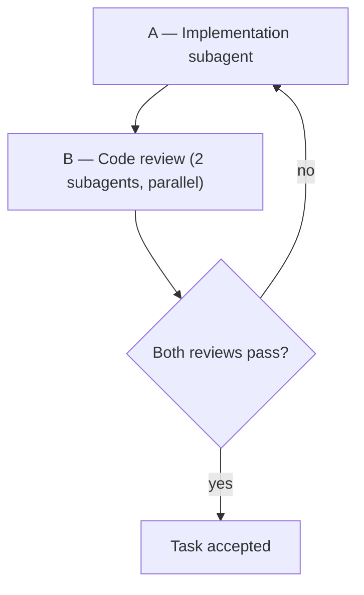

# Worktree Loop

**Explicit invocation.** Follow this skill when the user invokes `@worktree-loop` or `/worktree-loop`, or when `worktree.md` requires the execution pipeline for feature work in a linked worktree.

The **main thread orchestrates only** — it does not implement or review code directly.

## Prerequisite

Confirm a linked worktree (not main checkout):

```bash
GIT_DIR_ABS="$(realpath "$(git rev-parse --git-dir)")"
GIT_COMMON_ABS="$(realpath "$(git rev-parse --git-common-dir)")"
[ "$GIT_DIR_ABS" != "$GIT_COMMON_ABS" ] && git rev-parse --show-toplevel
```

Resolve feature docs per `.agents/rules/worktree.md` § Reintegration (slug → `.compozy/tasks/<slug>/`, linked `specs/`, `plans/`). Pass doc paths and scope into subagent prompts.

## Pipeline



Copy this checklist and update after each phase:

```
Worktree loop:
- [ ] A — Implementation complete
- [ ] B — Reviewer 1 pass
- [ ] B — Reviewer 2 pass
- [ ] B1 — Loop satisfied (2 passes) OR back to A
```

### A — Implementation (1 subagent)

Spawn **one** implementation subagent per task unit (Compozy task file, PRD slice, or scoped user request).

| Item | Rule |
| ---- | ---- |
| Ownership | Subagent owns edits, verification, commits per `execution-workflow.md` and `validation.md` |
| User questions | May pause for a blocking question; after the user answers, **resume the same** subagent — do not restart A unless scope changed |
| Delegation | `generalPurpose` (multi-file / feature); `cavecrew-builder` (≤2 files, site known). See cavecrew skill when token budget matters |
| Compozy tasks | Prefer `cy-execute-task` when a task file path is provided |

**Prompt must include:** worktree root path, feature slug, links to `_prd.md` / `_techspec.md` / task file, and acceptance criteria from docs.

### B — Code review (2 subagents)

After A finishes, spawn **two** code-review subagents **in parallel** on the same diff/branch scope.

| Item | Rule |
| ---- | ---- |
| Delegation | `code-review-excellence` (comprehensive, multi-language); `cavecrew-reviewer` (structured findings); `cy-review-round` when Compozy `reviews-NNN/` artifacts are required |
| Acceptance | **2 passes** — both reviewers **pass** in the same round (no 🔴 / blocking findings) |
| Parallelism | Launch both B subagents in **one** main-thread message |

**Pass criteria:** reviewer returns `No issues.` or zero 🔴 blocking items. Record pass/fail per reviewer on the checklist.

### B1 — Review loop

If **either** reviewer fails:

1. Do **not** merge, commit-as-done, or mark the Compozy task complete.
2. Send findings to **A** (resume implementation subagent with review output).
3. After fixes, re-run **B** (both reviewers, parallel).
4. Repeat until **both** pass in the same round.

## Main thread

| Do | Do not |
| -- | ------ |
| Spawn A and B; pass scope + doc paths | Implement or edit source inline |
| Relay user answers when A is blocked | Skip B because “looks fine” |
| Track pass/fail per reviewer; enforce B1 | Run only one reviewer |
| Persist follow-up work in task `memory/` when B exposes drift | Close task after one failed review |

## Completion

Task is accepted only when:

- Checklist shows A complete and **both** B reviewers passed in the latest round.
- Post-task verification from `execution-workflow.md` / `validation.md` was run inside A (or a final verify subagent if split).

Then reintegration may proceed per `.agents/rules/worktree.md` § Reintegration.

## Do not

- Complete worktree feature work without the A → B (2 passes) pipeline.
- Treat one reviewer pass as sufficient.
- Start merge/reintegration while B acceptance is unsatisfied.

## Related

| Topic | File |
| ----- | ---- |
| Worktrees, reintegration, handoff | `.agents/rules/worktree.md` |
| Env / PM2 setup | `@worktree-env` → `.agents/skills/worktree-env/SKILL.md` |
| Task execution | `cy-execute-task` |
| Review artifacts | `cy-review-round` |
| Code review (B phase) | `code-review-excellence` → `.agents/skills/code-review-skill/`; `cavecrew-reviewer` |
