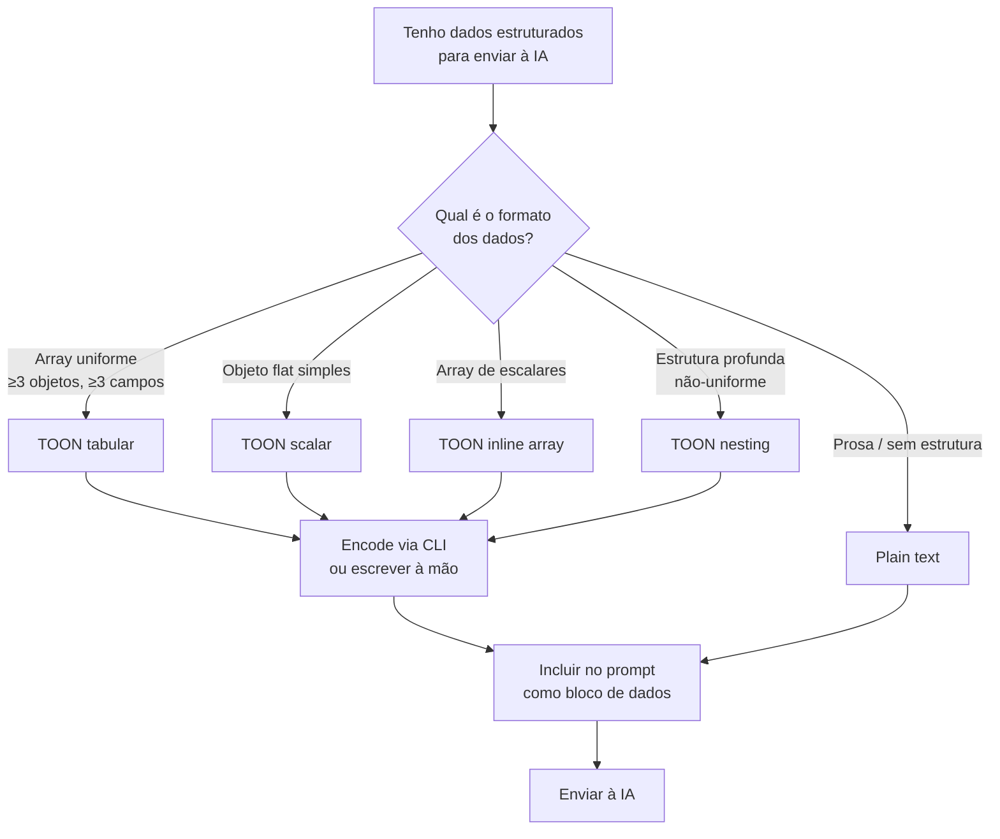

# TOON for AI Communication — Design

**Spec**: `.specs/technical/toon-ai-communication.md`
**Status**: Draft

---

## Architecture Overview

Este não é um componente de software — é um **protocolo de comunicação humano↔AI**. A arquitetura descreve o fluxo que o time segue ao montar prompts com dados estruturados.



---

## Encoding Workflow

### Via CLI (recomendado para JSON existente)

```bash
# Arquivo
npx @toon-format/cli input.json

# Stdin (pipe)
cat data.json | npx @toon-format/cli /dev/stdin

# Salvar output
npx @toon-format/cli input.json -o output.toon
```

### À mão (para payloads pequenos ou já conhecidos)

Para arrays uniformes pequenos ou objetos simples, escrever TOON à mão é mais rápido que gerar JSON e converter. Ver seção de padrões abaixo.

---

## Padrões de Payload TOON

Catálogo de formatos prontos para os casos mais comuns no contexto do job-tracker.

### 1. Lista de candidaturas

```toon
applications[N]{id,company,role,status,appliedAt,salaryMin,salaryMax}:
  1,Stripe,Senior Engineer,interview,2026-04-01,180000,220000
  2,Vercel,Staff Engineer,applied,2026-04-10,190000,240000
  3,Linear,Backend Engineer,rejected,2026-04-15,160000,200000
```

**Quando usar**: pedir análise comparativa, priorização, ou resumo de pipeline.

---

### 2. Objeto de candidatura (detalhes)

```toon
application:
  id: 42
  company: Stripe
  role: Senior Engineer
  status: interview
  appliedAt: 2026-04-01
  compensation:
    base: 180000
    equity: 0.05
    bonus: 20000
  tags[2]: remote,senior
  notes: "Conversa inicial ótima, próxima etapa é system design"
```

**Quando usar**: pedidos de feedback sobre candidatura específica, preparação para entrevista.

---

### 3. Histórico de status

```toon
history[4]{date,fromStatus,toStatus,note}:
  2026-04-01,null,applied,Candidatura enviada via LinkedIn
  2026-04-05,applied,screening,Recruiter entrou em contato
  2026-04-10,screening,interview,Agendado system design
  2026-04-18,interview,offer,Oferta recebida
```

**Quando usar**: pedir análise de tempo entre etapas, padrões de pipeline.

---

### 4. Comparação de ofertas

```toon
offers[3]{company,base,equity,bonus,remote,startDate}:
  Stripe,180000,0.05,20000,true,2026-06-01
  Vercel,175000,0.08,15000,true,2026-05-15
  Linear,165000,0.10,10000,true,2026-06-15
```

**Quando usar**: pedir análise de qual oferta é mais vantajosa considerando equity, RSU vesting, etc.

---

### 5. Lista de tarefas / checklist

```toon
tasks[N]{id,title,priority,done}:
  1,Atualizar currículo,high,true
  2,Preparar portfolio,high,false
  3,Estudar system design,medium,false
  4,Pesquisar empresa X,low,false
```

**Quando usar**: pedir sugestão de priorização, estimativa de tempo, ou próximos passos.

---

## Templates de Prompt

Templates completos prontos para uso. Substituir apenas os dados TOON e o contexto entre `[ ]`.

### Template A — Análise de pipeline

```
Analise meu pipeline de candidaturas e identifique:
1. Em qual empresa devo focar minha energia agora
2. Candidaturas que posso encerrar (inativas há >2 semanas)
3. Próximos passos recomendados

applications[N]{id,company,role,status,appliedAt}:
  [dados aqui]
```

---

### Template B — Preparação para entrevista

```
Vou ter uma entrevista de [tipo: system design / behavioral / técnica] na [empresa].
Prepare as 5 perguntas mais prováveis e uma resposta-guia para cada uma.

application:
  company: [empresa]
  role: [cargo]
  notes: "[o que já sei sobre o processo]"
```

---

### Template C — Comparação de ofertas

```
Compare as ofertas abaixo e me diga qual é financeiramente mais vantajosa
em um horizonte de 4 anos, considerando o vesting de equity.
Apresente um ranking com justificativa.

offers[N]{company,base,equity,bonus,remote}:
  [dados aqui]
```

---

### Template D — Revisão de mensagem / e-mail

```
Revise o e-mail abaixo para envio a um recrutador.
Mantenha tom profissional, direto e sem bajulação.
Aponte o que mudou e por quê.

context:
  recipient: recruiter
  company: [empresa]
  stage: [etapa atual]

---
[texto do e-mail aqui]
```

---

### Template E — Análise de dados brutos (JSON → TOON on the fly)

Quando você tem um JSON copiado de alguma ferramenta:

```bash
# 1. Salvar em temp
pbpaste > /tmp/data.json

# 2. Converter
npx @toon-format/cli /tmp/data.json

# 3. Copiar output para o prompt
```

---

## Tech Decisions

| Decisão                            | Escolha                      | Rationale                                                                                   |
| ---------------------------------- | ---------------------------- | ------------------------------------------------------------------------------------------- |
| Por que TOON e não YAML?           | TOON                         | YAML é mais verboso para arrays tabulares; TOON tem savings maiores e é lossless com JSON   |
| Por que não CSV puro?              | TOON                         | CSV não carrega metadados de estrutura; TOON mantém nesting e tipos                         |
| Por que não MessagePack/CBOR?      | TOON                         | Formatos binários não são legíveis — a IA precisa de texto; humanos também precisam revisar |
| Por que não compressão de texto?   | TOON                         | Compressão opaca reduz legibilidade e pode confundir o modelo                               |
| Output da IA continua em JSON?     | Sim                          | Não padronizar a resposta — o modelo responde no que for mais claro para a tarefa           |
| Conversão obrigatória ou opcional? | Obrigatória para arrays ≥3×3 | Abaixo disso o saving não justifica o atrito; acima disso é significativo                   |

---

## Regras de Escape (edge cases de payload)

| Situação                                 | Solução                                                    |
| ---------------------------------------- | ---------------------------------------------------------- |
| Valor contém vírgula                     | Envolver em aspas duplas: `"Acme, Inc"`                    |
| Valor contém aspas duplas                | Escapar com `""`: `"disse ""ok"""`                         |
| Valor contém quebra de linha             | Usar `\n` ou mover para bloco scalar                       |
| Array misto (tipos diferentes por linha) | Não usar tabular; usar nesting por objeto                  |
| Campo ausente em alguns registros        | Usar string vazia ou `null` explícito: `1,Stripe,,applied` |

---

## Checklist de Adoção

Antes de enviar um prompt com dados estruturados, verificar:

- [ ] Os dados são um array uniforme com ≥3 objetos e ≥3 campos? → usar TOON tabular
- [ ] Tem JSON copiado de alguma ferramenta? → converter antes com o CLI
- [ ] Os valores têm vírgulas ou aspas? → aplicar escape
- [ ] O bloco de dados está claramente separado das instruções no prompt? → usar `---` como separador
- [ ] O número de linhas `[N]` está correto? → contar antes de enviar

---

## References

- Spec: `.specs/technical/toon-ai-communication.md`
- TOON repo: https://github.com/toon-format/toon
- CLI: `npx @toon-format/cli`
- SDK: `@toon-format/core` — `encode(data)`, `encodeLines(data)`
