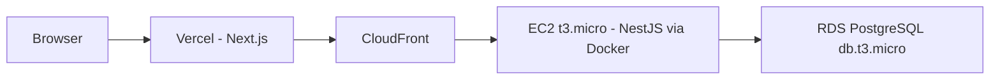
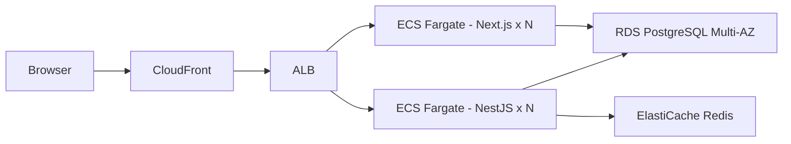

import { Meta } from "@storybook/addon-docs/blocks";

<Meta title="Documentation/Costs" />

# Costs

## Glossary

| Term        | Full Name                                       | What it does                                                     |
| ----------- | ----------------------------------------------- | ---------------------------------------------------------------- |
| EC2         | Elastic Compute Cloud                           | Virtual machine (server) on AWS                                  |
| RDS         | Relational Database Service                     | Managed PostgreSQL database on AWS                               |
| ALB         | Application Load Balancer                       | Distributes traffic across multiple instances                    |
| ECS         | Elastic Container Service                       | Runs Docker containers on AWS                                    |
| Fargate     | AWS Fargate                                     | Serverless compute engine for ECS — no server management         |
| ACM         | AWS Certificate Manager                         | Provisions and manages SSL/TLS certificates for free             |
| SSM         | AWS Systems Manager                             | Stores environment variables and secrets securely                |
| SSL/TLS     | Secure Sockets Layer / Transport Layer Security | Encrypts traffic between browser and server (the "S" in HTTPS)   |
| CloudFront  | Amazon CloudFront                               | AWS CDN — caches and serves content from edge locations globally |
| ElastiCache | Amazon ElastiCache                              | Managed Redis for caching and sessions                           |
| Redis       | Remote Dictionary Server                        | In-memory key-value store used for caching and session storage   |
| Multi-AZ    | Multi Availability Zone                         | Runs DB replicas in multiple data centers for high availability  |
| CDN         | Content Delivery Network                        | Network of edge servers that cache content close to users        |

## IP1 — Initial (Low Traffic)

> Vercel handles Next.js; EC2 is dedicated to NestJS only. Suitable up to ~1K active users/month or while EC2 CPU/memory stays below 70%.

| Service                    | Free Tier      | After Free Tier |
| -------------------------- | -------------- | --------------- |
| Vercel (Next.js)           | $0             | $0              |
| EC2 t3.micro (NestJS)      | $0 (12 months) | ~$8/mo          |
| RDS PostgreSQL db.t3.micro | $0 (12 months) | ~$15/mo         |
| CloudFront                 | $0             | ~$0             |
| Cloudflare DNS             | $0             | $0              |
| ACM                        | $0             | $0              |
| SSM Parameter Store        | $0             | $0              |
| AWS Budgets                | $0             | $0              |
| AWS CloudWatch             | $0             | ~$0             |
| GitHub Actions             | $0             | $0              |
| Sentry                     | $0             | $0              |
| PostHog                    | $0             | $0              |
| **Total**                  | **$0/mo**      | **~$23/mo**     |

### Limits

- EC2 t3.micro: 1 vCPU, 1 GB RAM — dedicated to NestJS only, comfortable headroom
- RDS db.t3.micro: 1 vCPU, 1 GB RAM, 20 GB storage — no Multi-AZ, no failover
- Vercel free tier: 100 GB bandwidth, 100K function invocations/mo — sufficient for low traffic
- Single EC2 instance — no redundancy, full outage if it goes down

## IP2 — Scale (Higher Traffic)

> NestJS EC2 showing sustained pressure (CPU/memory >70%), or Vercel approaching free tier limits — typically beyond ~1K active users/month. Next.js migrates from Vercel to ECS Fargate in this phase.

| Service                             | Estimated Cost  |
| ----------------------------------- | --------------- |
| ALB                                 | ~$16/mo         |
| ECS Fargate (Next.js)               | ~$10-20/mo      |
| ECS Fargate (NestJS)                | ~$10-20/mo      |
| RDS PostgreSQL db.t3.small Multi-AZ | ~$25-30/mo      |
| ElastiCache cache.t3.micro          | ~$15/mo         |
| CloudFront                          | ~$0-5/mo        |
| Cloudflare DNS                      | $0              |
| GitHub Actions                      | $0              |
| Sentry                              | $0              |
| PostHog                             | $0              |
| **Total**                           | **~$77-107/mo** |

### Limits

- Cost grows linearly with traffic — no hard ceiling
- Single AWS region — no global distribution
- RDS Multi-AZ covers failover but not read scaling (add read replicas if needed)
- ECS Fargate has no free tier — cost starts from day one

## Cost Guardrails (IP1+)

- AWS Budgets alert: $15/mo during free tier / $30/mo after free tier
- All resources tagged `project=job-tracker`
- Avoid: NAT Gateway (~$32/mo fixed), unattached Elastic IPs, idle RDS instances
